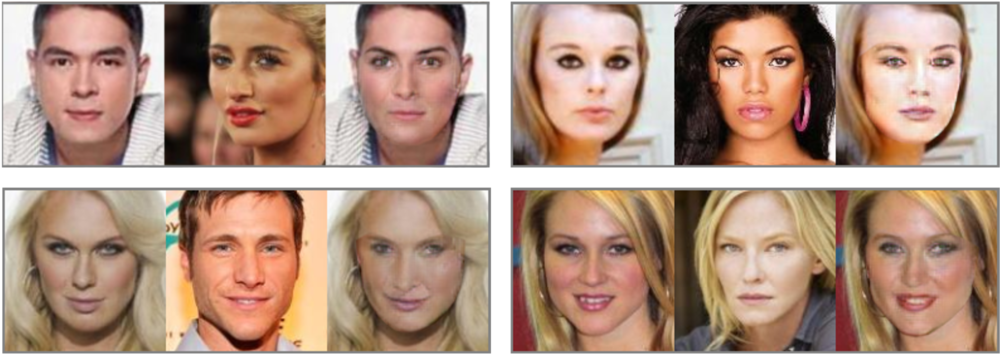
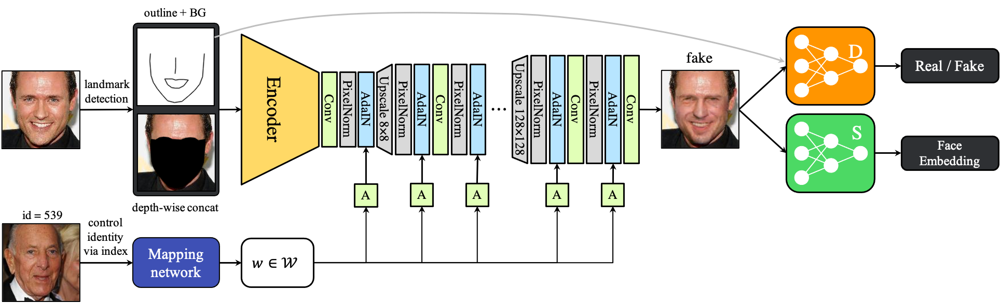

# Conditional Face De-Identification GANs

**Picture:** *Left: original identity, Center: target identity, Right: de-identified image*

This repository contains the official TensorFlow implementation of the following paper:

> **A Conditional Face De-Identification Model for Controllable Generation**
>
> Jungwoo Nam
> 
> http://www.riss.kr/link?id=T15776214
> 
> **Abstract:** *The increasing usage of computer vision technology in our daily life raises concern for data privacy. Accordingly, it is becoming important to process the data while avoiding privacy leakage when developing computer vision technologies such as people tracking or action recognition. We propose a new conditional face de-identification model that is able to control the image generation procedure. The goal is to remove identifying characteristics of faces, while preserving other features like a pose, illumination and an expression. We achieve this by a feed-forward encoder- decoder architecture in the generator that is conditioned on the sparse representation of a person’s facial image. Our model is able to perform de- identification while producing high-quality images that can be used for any computer vision tasks, such as face detection or tracking. Unlike previous GANs-based methods, our method has controls over generation procedure, ensuring visual diversity as well as de-identification. We demonstrate the effectiveness of our approach by comparing it with earlier de-identification studies including GANs-based ones.*

## Network architecture

## Tested on

- 2 NVIDIA TITAN RTX GPUs
- 128GB RAM
- Ubuntu 18.04 64-bit
- Python 3.8
- TensorFlow 2.3
- OpenCV 4.4

## Related works

### Discriminator architecture
- [PGGAN](https://arxiv.org/abs/1710.10196) (Tero Karras et al.)

### Generator architecture
- [StyleGAN](https://arxiv.org/abs/1812.04948) (Tero Karras et al.)

### Facial embedding network architecture
- [ResNet](https://arxiv.org/abs/1512.03385) (Kaiming He et al.)

### Loss function
- [Proxy NCA](https://arxiv.org/abs/1703.07464) (Yair Movshovitz-Attias et al.)
- Contrastive loss [paper1](https://ieeexplore.ieee.org/document/1467314) (Sumit Chopra et al.) [paper2](https://ieeexplore.ieee.org/document/1640964) (Raia Hadsell et al.)

### Dataset
- [CelebA Dataset](https://arxiv.org/abs/1411.7766) (Ziwei Liu et al.)